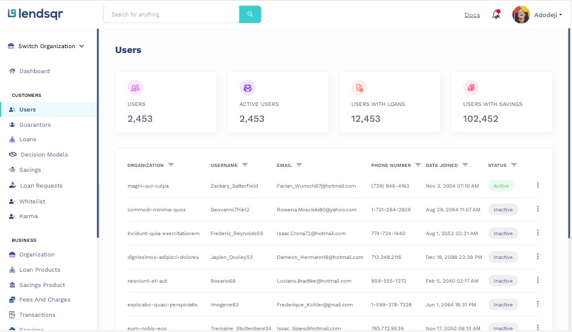

<!-- Improved compatibility of back to top link: See: https://github.com/othneildrew/Best-README-Template/pull/73 -->

<!--
[![Contributors][contributors-shield]][contributors-url]
[![Forks][forks-shield]][forks-url]
[![Stargazers][stars-shield]][stars-url]
[![Issues][issues-shield]][issues-url]
[![MIT License][license-shield]][license-url]
[![LinkedIn][linkedin-shield]][linkedin-url] -->

<!-- PROJECT LOGO -->
 

  

<h2 align="center">Lendsqr</h2>

<!-- TABLE OF CONTENTS -->

  
Table of Contents

  <ol>
    <li>
      <a href="#about-the-project">About The Project</a>
      <ul>
        <li><a href="#built-with">Built With</a></li>
      </ul>
    </li>
    <li>
      <a href="#getting-started">Getting Started</a>
    </li>
    <!-- <li><a href="#usage">Usage</a></li> -->
    <li><a href="#contact">Contact</a></li>
  </ol>

<!-- ABOUT THE PROJECT -->

## About The Project

### Screenshot

- This is the lendsqr web app and it :

* displays a list of users/customers
* displays details about each user making use of the platform
* enables the admin to blacklist, activate and deactivate users
* diplays business organizations and loan products

(<a href="#readme-top">back to top</a>)

### Built With

- [![Javascript][javascript]][https://www.javascript.com/]
- [![Typescript][typescript]][https://www.typescriptlang.org/]
- [![React][react.js]][https://react.dev/]
- [![Reduxjs/toolkit][reduxjs/toolkit]][https://redux-toolkit.js.org/]
- [![scss][sass-lang][https://sass-lang.com/]

(<a href="#readme-top">back to top</a>)

<!-- USAGE EXAMPLES -->

<!-- ## Usage -->

<!-- Use this space to show useful examples of how a project can be used. Additional screenshots, code examples and demos work well in this space. You may also link to more resources. -->

<!-- _For more examples, please refer to the [Documentation](https://example.com)_ -->

<!-- 
(<a href="#readme-top">back to top</a>)
 -->

<!-- CONTACT -->

## Contact

[@twitter_handle](https://twitter.com/@favourejim56) - favour.ejim@transformafricalimited.com

Project Link: 

(<a href="#readme-top">back to top</a>)

<!-- ACKNOWLEDGMENTS -->

<!-- MARKDOWN LINKS & IMAGES -->
<!-- https://www.markdownguide.org/basic-syntax/#reference-style-links -->

<!-- [contributors-shield]: https://img.shields.io/github/contributors/github_username/repo_name.svg?style=for-the-badge
[contributors-url]: https://github.com/github_username/repo_name/graphs/contributors
[stars-shield]: https://img.shields.io/github/stars/github_username/repo_name.svg?style=for-the-badge
[stars-url]: https://github.com/github_username/repo_name/stargazers
[issues-shield]: https://img.shields.io/github/issues/github_username/repo_name.svg?style=for-the-badge
[issues-url]: https://github.com/github_username/repo_name/issues
[license-shield]: https://img.shields.io/github/license/github_username/repo_name.svg?style=for-the-badge
[license-url]: https://github.com/github_username/repo_name/blob/master/LICENSE.txt
[linkedin-shield]: https://img.shields.io/badge/-LinkedIn-black.svg?style=for-the-badge&logo=linkedin&colorB=555
[linkedin-url]: https://linkedin.com/in/linkedin_username -->
<!-- [product-screenshot]: images/screenshot.png -->

[react.js]: https://img.shields.io/badge/React-20232A?style=for-the-badge&logo=react&logoColor=61DAFB
[react-url]: https://reactjs.org/
